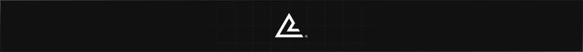

<p align="center">
  
</p>

# Andrea Losavio - Portfolio Website

Personal portfolio website designed to generate leads and attract potential
clients.

## Tech Stack

- **Next.js 16.1.6** (App Router)
- **TypeScript**
- **Tailwind CSS**
- **shadcn/ui** (only required components)
- **next-intl** for internationalization (IT / EN)
- **MDX** blog content, with `gray-matter` frontmatter validation
- **Resend API** for contact form emails
- **Motion** for animations
- **Vitest** for unit tests

## Getting Started

### Prerequisites

- Node.js 20+
- npm

### Installation

```bash
npm install
```

### Environment Variables

Copy `.env.sample` to `.env` and configure the variables:

```bash
cp .env.sample .env
```

**Required variables:**

- `NEXT_PUBLIC_SITE_URL` - Your domain (without https://)
- `RESEND_API_KEY` - API key from [Resend](https://resend.com)
- `OWNER_EMAIL` - Email to receive contact form submissions
- `FROM_EMAIL` - Sender email for notifications
- `CSRF_SECRET` - Secret for CSRF protection (generate with
  `openssl rand -hex 32`)
- `CAT_API_KEY` - (Optional) API key from [The Cat API](https://thecatapi.com)

**Deployment (Vercel):**

Set these environment variables in your Vercel project settings:

1. Go to your project → Settings → Environment Variables
2. Add all variables from `.env.sample`
3. **Make sure to set `NEXT_PUBLIC_SITE_URL` to `www.andrealosavio.com`**
   (without https://)
4. Deploy!

### Development

```bash
npm run dev
```

Open [http://localhost:3000](http://localhost:3000) in your browser.

### Build

```bash
npm run build
npm start
```

### Tests

```bash
npm test          # runs vitest once (alias for npx vitest run)
```

## Project Structure

```
content/
└── blog/
    ├── it/                  # Italian articles (.mdx)
    └── en/                  # English articles (.mdx), paired by translationKey

src/
├── app/                    # App Router pages and layouts
│   └── [locale]/           # Internationalized routes
│       ├── (homepage)/     # Homepage route group
│       │   ├── components/ # Page-scoped components
│       │   └── sections/   # Page sections
│       ├── blog/            # Blog index + article page
│       └── components/     # Locale-specific shared components
├── components/             # Shared reusable components
│   ├── mdx/                # Components available inside article bodies
│   └── ui/                 # Primitive components (shadcn)
├── constants/              # Shared constants
├── libs/                   # External libraries and vendor logic
│   ├── blog/                # Frontmatter validation, article source
│   └── i18n/               # Internationalization config
├── mdx-components.tsx       # MDX component overrides
├── translations/           # i18n dictionaries
│   ├── en/                 # English translations
│   └── it/                 # Italian translations
└── utils/                  # Utility functions
```

## Publishing a Blog Article

Every article exists as a pair of native MDX files —
`content/blog/it/<slug>.mdx` and `content/blog/en/<slug>.mdx` — linked by a
shared `translationKey` in their frontmatter.

- **Preferred**: invoke the `blog-ghostwriter` skill and follow its interview.
  It produces both files with validated frontmatter, in Andrea's voice.
- **Manual**: hand-write both files. The build validates the frontmatter and
  fails with a descriptive error on anything malformed (missing fields, wrong
  types, an unregistered tag, a mismatched `translationKey` pair), so a broken
  article never ships silently.

## Design

The design system is defined in Figma:
[Andrea Losavio 2.0 - Design System](https://www.figma.com/design/1f4uJbwdNlmM1lAxob0hn2/Andrea-Losavio-2.0---Design-System)

## License

All rights reserved.
